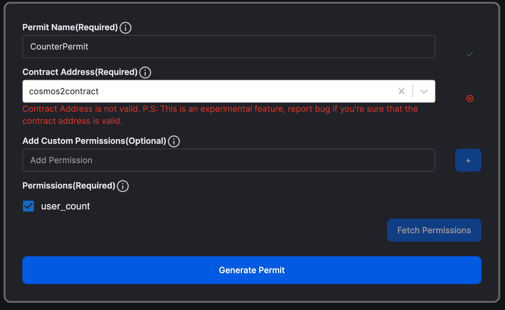

# Migrating a CosmWasm Contract to Secret Network

In this tutorial we'll teach you step by step process to migrate a cosmwasm contract to secret network.

## Step 1: 

Copy the `cw-counter` folder and rename it `secret-counter`.

## Multi-Tests

When working with Secret Network, it's crucial to understand that official support for multi-tests is not provided. As a result, it's advisable to exclude the `integration_tests.rs` file from your project. To implement this, you'll need to: 

### 1. remove specific lines from your `Cargo.toml` file:

```toml
[dev-dependencies]
cw-multi-test = "0.15.1"
```

### 2. Remove/Delete `integration_tests.rs` file

Next it's best to remove `integration_tests.rs` because as I mentioned before secret network doesn't supports multi-tests.


### 3. Remove this line from `lib.rs` as well

```Rust
pub mod integration_tests;
```

### 4. Remove/Delete `helpers.rs` file

Since in this example `helper.rs` are only used in `integration_tests.rs`

### 5. Remove this line from `lib.rs` as well

```Rust
pub mod helpers;
```

NOTE: There are some other teams that have worked with multi-test. [This](https://github.com/securesecrets/secret-plus-utils) package by secure secrets can be an alternative to secret networks storage package aka secret-toolkit. But it's recommended to use secret-toolkit for advanced storage packages.

## Step 2: Update `Cargo.toml`

This document outlines changes made to contract dependencies in `Cargo.toml`.

### 1. Change the name package name in Cargo.toml

```toml
name = "cw-counter"
..
```

Replace With:

```toml
name = "secret-counter"
..
```

### 2. Change the contract name in /bin/schema.rs

```Rust
use cw_counter::msg::{ExecuteMsg, InstantiateMsg, QueryMsg};
```

With:

```Rust
use secret_counter::msg::{ExecuteMsg, InstantiateMsg, QueryMsg};
```

### 3. Build and run tests

After these changes, build and test the project to check for any errors:

```Rust
cargo build
cargo test
```
That's it for the Cargo.toml modifications. Proceeding with these changes should get your Secret Network contract off to a solid start.

## Updating CosmWasm Dependencies

When working with Secret Network, it's necessary to replace certain existing CosmWasm dependencies such as `cosmwasm-schema`, `cosmwasm-std`, and `cosmwasm-storage`. The Secret Network has its own versions of these packages.

Start by removing the following lines from your `Cargo.toml` file:

```toml
[dependencies]
cosmwasm-schema = "1.1.3"
cosmwasm-std = "1.1.3"
cosmwasm-storage = "1.1.3"
```

Replace with:

```toml
cosmwasm-schema = { version = "1.1.8" }
cosmwasm-std = { git = "https://github.com/scrtlabs/cosmwasm/", default-features = false, tag = "v1.1.9-secret" }
cosmwasm-storage = { git = "https://github.com/scrtlabs/cosmwasm/", tag = "v1.1.9-secret" }
secret-toolkit = { git = "https://github.com/scrtlabs/secret-toolkit", features = [
  "permit",
  "viewing-key",
], rev = "9b74bdac71c2fedcc12246f18cdfdd94b8991282" }
```

After making these changes to your dependencies, you may encounter errors in files such as `contract.rs`, `helpers.rs`, and `state.rs`. This is normal due to the different requirements of Secret Network's versions of the CosmWasm packages.

## Updating State.rs

Some standard dependencies need to be swapped with alternatives provided by `secret_toolkit`. The below instructions detail how to make these replacements in the `state.rs` file.

### 1. Replace `cw_storage_plus` Dependencies with `secret-toolkit`

```Rust
use cw_storage_plus::{Item, Map};
```

With:

```Rust
use secret_toolkit::storage::{Item,Keymap};
```

The secret_toolkit is Secret Network's alternative to cw_storage_plus. While they both handle storage packages, they have different names and offer different levels of flexibility.

### 2. Edit the STATE Item Key

The Item key needs to be changed because secret_toolkit requires a byte string literal instead of a string literal for the key.

```Rust
pub const STATE: Item<State> = Item::new("state");
```

Replace with:

```Rust
pub const STATE: Item<State> = Item::new(b"state");
```

### 3. Edit the USER_STATE Item Key

The Map in cw_storage_plus is more or less similar to Keymap in secret_toolkit. Map key also needs to be changed as well because secret toolkit required byte string literal instead of string literal for the key

```Rust
pub const STATE: Map<Addr, UserState> = Map::new("user_state");
```

Replace with:

```Rust
pub const USER_STATE: Keymap<Addr, UserState> = Keymap::new(b"user_state");
```

With these changes, all errors in state.rs should be resolved.

## contract.rs

The `contract.rs` file might be presenting a lot of errors. Don't panic; we'll dissect and resolve each error step by step.

### 1. Handling `cw2::set_contract_version`

Secret Network doesn't have an alternative for `cw2`, so the related lines have to be removed:

```rust
use cw2::set_contract_version;

//...

pub fn instantiate(
    deps: DepsMut,
    _env: Env,
    info: MessageInfo,
    msg: InstantiateMsg,
) -> Result<Response, ContractError> {
//...
set_contract_version(deps.storage, CONTRACT_NAME, CONTRACT_VERSION)?;
//...
}
```

The cw2 module is used to set the contract version, which is crucial for migrations. At present, we don't have a strategy for handling contract migrations on Secret Network compared to other networks. Read more about migration from [secret network docs](https://docs.scrt.network/secret-network-documentation/development/development-concepts/contract-migration).

### 2. Updating increment function

As we've already mentioned, Item/Map from CosmWasm are slightly different in terms of their helper functions compared to Secret Network. Here's the Secret Network version of the increment function.

This is the migrated version of the contract:

```Rust
    pub fn increment(deps: DepsMut, info: MessageInfo) -> Result<Response, ContractError> {
        STATE.update(deps.storage, |mut state: State| {
            state.count += 1;
            Ok(state)
        })?;

        let sender = info.sender;
        let mut user: UserState = USER_STATE
            .get(deps.storage, &sender)
            .unwrap_or(UserState { count: 0 });
        user.count += 1;
        USER_STATE.insert(deps.storage, &sender, &user)?;

        Ok(Response::new().add_attribute("action", "increment"))
    }
```

In this version, Map is replaced with KeyMap, which uses get and insert instead of load and save.

Now, try to modify the user_count query **YOURSELF** based on these changes.

Ok let's check the migrated solution:

```Rust
    pub fn user_count(deps: Deps, addr: Addr) -> StdResult<GetUserCountResponse> {
        let user_state = USER_STATE
            .get(deps.storage, &addr)
            .unwrap_or(UserState { count: 0 });
        Ok(GetUserCountResponse {
            count: user_state.count,
        })
    }
```

Now run the test with `cargo test` on the `secret-counter`. It should pass without an issues.

## Adding User Authentication

Secret contracts provide computational privacy. Permissioned viewing is entirely unique to Secret Network with its encrypted state. It gives you ability to have precise control over who has access to what data. In order to determine when data is allowed to be released however, you need to have a way to prove who is trying to access it. Our two ways of doing this are through Viewing Keys and Permits/Certs.

If you want to learn more about viewing keys and permits. And how they are implemented please check our pathway '[Implementing Viewing key and Permits](https://scrt.university/pathways/33/implementing-viewing-keys-and-permits)'.

For this contract we'll restrict access to `QueryMsg::GetUserCount` and leaving global `QueryMsg::GetCount {}` open to the public.

There are two steps to adding authenticatio. First we'll add viewing keys and then Query Permits.

### 1. **Adding Viewing keys**

Viewing keys can be compared to passwords. When performing an authenticated query using viewing keys, you need to provide a public address and its associated viewing key. This process is similar to authenticating your username (public address) and password (viewing key). For more details and explaination please check [implementing Viewing Keys](https://scrt.university/pathways/33/implementing-viewing-keys-and-permits).

Viewing keys need to be created/set by sending a transaction to the contract. At the start you were told to add this dependency.

```Rust
secret-toolkit = { git = "https://github.com/scrtlabs/secret-toolkit", features = [
  "permit",
  "viewing-key",
], rev = "9b74bdac71c2fedcc12246f18cdfdd94b8991282" }
```

With `viewing-key` package the implementation process of viewing keys is streamlined.

#### **Defining the messages**

In your message type definitions (typically in the msg.rs file), you need to make the following additions:

1. Add execute function message to create viewing keys
2. Create viewing key query interface
3. Implement get_validation_params method (recommended but not strictly necessary)

**1. Add execute function message to create viewing keys (`msg.rs`)**

```Rust
pub enum ExecuteMsg {
    ....
    CreateViewingKey { entropy: String },
    SetViewingKey { key: String },
}
```

CreateViewingKey and SetViewingKey are two types of messages. CreateViewingKey generates a random viewing key and associates it with the user's address, while SetViewingKey allows the user to set a specific key of their choice. Although SetViewingKey provides more user control, it risks weak key selection. From an end user's perspective, the two operations may appear identical.

**2. Create viewing key query interface (`msg.rs`)**

The contract initiator supplies a prng_seed for the random number generator. This seed, accessible only by the contract, is used in the creation of viewing keys.
Add `prng_seed` to the `InstantiateMsg`.

```Rust
#[cw_serde]
pub struct InstantiateMsg {
    pub count: i32,
    pub prng_seed: Binary,
}
```

ExecuteAnswer enum is used to define the response type a smart contract provides upon its execution. Specifically, the CreateViewingKey variant is returned when a new viewing key is generated by the contract, encapsulating the generated key within the key field.

```Rust
#[cw_serde]
pub enum ExecuteAnswer {
    // Native
    CreateViewingKey { key: String },
}
```

Query interfaces are already in the contract but now add key field because the querier needs to provide the addr (public account address) and key (viewing key) fields. The contract verifies these inputs and responds with the private data if they are valid. Otherwise, an error occurs.

```Rust
#[cw_serde]
#[derive(QueryResponses)]
pub enum QueryMsg {
    ...
    #[returns(GetUserCountResponse)]
    GetUserCount { addr: Addr, key:String },
}


#[cw_serde]
pub struct GetUserCountResponse {
    pub count: i32,
}

```

**3. Implement get_validation_params method (`msg.rs`)**

We're implementing helper functions to confirm the viewing key for a provided user address.

import `Deps`, `StdResult` and `Binary` from cosmwasm_std in `msg.rs`

```Rust
use cosmwasm_std::{Addr, Binary, Deps, StdResult};
```

```Rust
impl QueryMsg {
    pub fn get_validation_params(&self, deps: Deps) -> StdResult<(Vec<Addr>, String)> {
        match self {
            Self::GetUserCount { addr, key } => {
                let address = deps.api.addr_validate(addr.as_str())?;
                Ok((vec![address], key.clone()))
            }
            _ => panic!("This query type does not require authentication"),
        }
    }
}

```

We also check the validity of the address by using the api.addr_validate method. If the address is valid, the function returns a tuple containing the validated address and the viewing key.

#### **Updating Contract.rs**

The following steps need to be taken for the main body of the contract (typically in contract.rs):

1. import viewing key package from Secret Toolkit

2. `set_seed` in `instanstiate`

3. execute function(s) to create viewing keys

4. write code in query entry point to handle viewing key queries. It can be modularized into a separate function that handles all vk queries

5. create functions to handle the queries (as you would with any query)

##### **import vk toolkit, sha256 and ExecuteAnswer**

```Rust
use secret_toolkit::viewing_key::{ViewingKey, ViewingKeyStore};
use secret_toolkit::crypto::sha_256;
use crate::msg::{ExecuteAnswer, ...};

```

##### Set Seed for `CreateViewingKeys`

```Rust
#[cfg_attr(not(feature = "library"), entry_point)]
pub fn instantiate(
    deps: DepsMut,
    _env: Env,
    info: MessageInfo,
    msg: InstantiateMsg,
) -> Result<Response, ContractError> {
...

    let prng_seed_hashed = sha_256(&msg.prng_seed.0);
    ViewingKey::set_seed(deps.storage, &prng_seed_hashed);

...
}
```

##### Execute function(s) to create viewing keys

We're allowing Execute function to handle set and create viewing key functions:

```Rust
pub fn execute(
    deps: DepsMut,
    env: Env,
    info: MessageInfo,
    msg: ExecuteMsg,
) -> Result<Response, ContractError> {
    match msg {
        ExecuteMsg::SetViewingKey { key } => execute::try_set_key(deps, info, key),
        ExecuteMsg::CreateViewingKey { entropy, .. } => {
            execute::try_create_key(deps, env, info, entropy)
        }
        // ...
    }
}
```

We'll first look into SetViewingKey, try_set_key function implements the ViewingKey::set associated function from the ViewingKeyStore trait

```Rust
pub fn try_set_key(deps: DepsMut, info: MessageInfo, key: String) -> Result<Response, ContractError> {
    ViewingKey::set(deps.storage, info.sender.as_str(), key.as_str());
    Ok(Response::new())
}
```

As you might remember that we used `ViewingKey::set_seed` to set the prng_seed. This seed is used by the random number generator to create veiwing keys.

`try_create_key` function:

```Rust
    pub fn try_create_key(
        deps: DepsMut,
        env: Env,
        info: MessageInfo,
        entropy: String,
    ) -> Result<Response, ContractError> {
        let key = ViewingKey::create(
            deps.storage,
            &info,
            &env,
            info.sender.as_str(),
            entropy.as_ref(),
        );

        Ok(Response::new().set_data(to_binary(&ExecuteAnswer::CreateViewingKey { key })?))
    }
```

The ViewingKey struct provides the create associated function that handles the random number generation internally. The function saves the viewing key in the contract storage, associating it with the sender's public address.

##### Query entry point to handle vk queries

Create a function that only handles the viewing key queries:

```Rust

pub mod query {

  ...

      pub fn viewing_keys_queries(deps: Deps, msg: QueryMsg) -> StdResult<Binary> {
        let (addresses, key) = msg.get_validation_params(deps)?;

        for addr in addresses {
            let result = ViewingKey::check(deps.storage, addr.as_str(), key.as_str());
            if result.is_ok() {
                return match msg {
                    // Base
                    QueryMsg::GetUserCount { addr, .. } => {
                        Ok(to_binary(&query::user_count(deps, addr)?)?)
                    }
                    _ => panic!("This query type does not require authentication"),
                };
            }
        }

        panic!("Wrong viewing key for this address or viewing key not set")
    }
}
```

Replace `QueryMsg::GetUserCount` in `query` function

```Rust
QueryMsg::GetUserCount { addr } => to_binary(&query::user_count(deps, addr)?),
```

With:

```Rust
_ => query::viewing_keys_queries(deps, msg),
```

It means that any Query Message that doesn't match any other message are directed to `viewing_keys_queries`

```Rust

    pub fn viewing_keys_queries(deps: Deps, msg: QueryMsg) -> StdResult<Binary> {
        let (addresses, key) = msg.get_validation_params(deps)?;

        for addr in addresses {
            let result = ViewingKey::check(deps.storage, addr.as_str(), key.as_str());
            if result.is_ok() {
                return match msg {
                    // Base
                    QueryMsg::GetUserCount { addr, .. } => {
                        Ok(to_binary(&query::user_count(deps, addr)?)?)
                    }
                    _ => panic!("This query type does not require authentication"),
                };
            }
        }

      return Err(StdError::GenericErr {
            msg: "Wrong viewing key for this address or viewing key not set".to_string(),
        });
    }

```

##### Modifying Unit-test

Viewing key is added and now it's time to modify the unit tests to check the results. We'll change increment test. Read though the test to understand. Remember to import all the packages needed for unit-test.

```Rust
 use super::*;
 use crate::msg::GetUserCountResponse;
 use cosmwasm_std::testing::{mock_dependencies, mock_env, mock_info};
 use cosmwasm_std::{coins, from_binary, Addr, StdError};

    ....


 #[test]
    fn query_with_vk() {
        //..
        //Using Viewing key to check the counter.

        //Setting viewing_key first
        let info = mock_info("secret_user", &coins(2, "token"));
        let msg = ExecuteMsg::SetViewingKey {
            key: "vk_1".to_string(),
        };
        let _res = execute(deps.as_mut(), mock_env(), info.clone(), msg).unwrap();

        //Querying with wrong address
        let res = query(
            deps.as_ref(),
            mock_env(),
            QueryMsg::GetUserCount {
                addr: Addr::unchecked("not_secret_user"),
                key: "vk_1".to_string(),
            },
        );
        assert_eq!(
            res.unwrap_err(),
            StdError::GenericErr {
                msg: "Wrong viewing key for this address or viewing key not set".to_string(),
            }
        );

        //Querying with correct address
        let res = query(
            deps.as_ref(),
            mock_env(),
            QueryMsg::GetUserCount {
                addr: Addr::unchecked("secret_user"),
                key: "vk_1".to_string(),
            },
        )
        .unwrap();
        let value: GetUserCountResponse = from_binary(&res).unwrap();
        assert_eq!(1, value.count);
    }
```

Now run `cargo test` to check the final results

### 2. Adding Query Permits

You can learn more about query permits over here and now it's time to implement those:

#### Define the messages

First, we need to define the query messages that require permits within the QueryMsg enum. Typically, all permit queries are grouped under a single variant, while the individual permit queries are defined in a separate enum

##### msg.rs

Importing Permit from secret-toolkit

```Rust
use secret_toolkit::permit::Permit;
```

Custom Permissions:

```Rust

#[cw_serde]
pub enum CounterContractPermissions {
    UserCount,
    Owner,
}
```

```Rust

#[cw_serde]
#[derive(QueryResponses)]
pub enum QueryMsg {
//..
    #[returns(QueryWithPermit)]
    WithPermit {
        permit: Permit<CounterContractPermissions>,
        query: QueryWithPermit,
    },
}

#[cw_serde]
#[derive(QueryResponses)]
pub enum QueryWithPermit {
    #[returns(GetUserCountResponse)]
    GetUserCount {},
}
```

The code defines a variant WithPermit in the QueryMsg enum to handle all permit-related queries. This variant has two fields: permit and query. The permit field represents the required permit, holding the digital signature, public address of the signer, and the plaintext message. The query field represents the specific query to be executed using the permit. These two fields allow for permit and associated query information to be passed together when making a permit-related query. This design pattern allows for flexibility and modularity, and is a common practice in SNIPs.
See that GetUserCount doesn't requires any `addr` or `key` because permit provides `addr`.

In code above we create an custom permissions enum, just for this contract. Permits allow custom Permissions other than the Permssions that Snip-20 and Snip-721 uses. Add an enum that is used by the user to give permissions to only specific queries. `Owner` permission allows to access all queries while `UserCount` permission only allows `user_count` query.

#### Updating contract.rs

In the main body of the contract (typically in contract.rs), the following steps need to be taken:

1. import the permit package from Secret Toolkit

2. add message variants to the query entry point enum

3. write code to check permit validity and handle the result

4. add revoke permits execute function

##### Import permit package from Secret Toolkit

```Rust

use secret_toolkit::{
    // Permit is required in any basic implementation
    permit::{ Permit },
    // requred to allow permits to be revoked
    permit::RevokedPermits,
};

```

The permit package offers Permit and RevokedPermits structures and a TokenPermissions enum for default permissions. Developers can use these defaults or create custom permissions.

##### add message variants to the query entry point enum

Adding the necessary message variants to the QueryMsg enum in the query entry point of the contract.

```Rust

#[cfg_attr(not(feature = "library"), entry_point)]
pub fn query(deps: Deps, _env: Env, msg: QueryMsg) -> StdResult<Binary> {
    match msg {
        QueryMsg::GetCount {} => to_binary(&query::count(deps)?),
        QueryMsg::WithPermit { permit, query } => {
            permit_queries(
                deps, _env, // env is sometimes not needed
                permit, query,
            )
        }
        _ => query::viewing_keys_queries(deps, msg),
    }
}
```

##### Write code to check permit validity and handle the result

In this step, we write code to handle permit queries within the permit_queries function.

first include this string literal as it will be prefix for revoked permits

```Rust
const PREFIX_REVOKED_PERMITS: &str = "prefix_revoked_permits";
```

Now `permit_queries`

```Rust
    pub fn permit_queries(
        deps: Deps,
        env: Env,
        permit: Permit<CounterContractPermissions>,
        query: QueryWithPermit,
    ) -> Result<Binary, StdError> {
        // Validate permit content
        let contract_address = env.contract.address;

        let account = secret_toolkit::permit::validate(
            deps,
            PREFIX_REVOKED_PERMITS,
            &permit,
            contract_address.into_string(),
            None,
        )?;

        // Permit validated! We can now execute the query.
        match query {
            QueryWithPermit::GetUserCount {} => {
                if !permit.check_permission(&CounterContractPermissions::UserCount) {
                    return Err(StdError::generic_err(format!(
                        "No permission to query balance, got permissions {:?}",
                        permit.params.permissions
                    )));
                }
                let address = Addr::unchecked(account);

                to_binary(&user_count(deps, address)?)
            }
        }
    }
```

##### Adding Unit-tests

Now we're at a tricky part, to create a permit and test the permit as well. We'll be using [cryptoclerk.xyz](cryptoclerk.xyz) you can navigate to `'Permit Wizard/Permit Generator`. Here you can input your Permit Name, contract address and permission and sign it using your keplr wallet.

Here's an example used in the unit-tests



Let's see unit-test

```Rust

 fn query_with_permit() {
    const USER: &str = "secret12eqwlqwcu2cundyg8ytnuhjnr29fh3zgt68602";
    const TOKEN: &str = "cosmos2contract";
    const PERMIT_NAME: &str = "CounterPermit";
    const CHAIN_ID: &str = "secret-4";

    // ... Executing counter

    // Using Permit to check the counter.

    // 1) Checking signature validity
    let permit: Permit<CounterContractPermissions> = Permit {
        params: PermitParams {
            allowed_tokens: vec![TOKEN.to_string()],
            permit_name: PERMIT_NAME.to_string(),
            chain_id: CHAIN_ID.to_string(),
            permissions: vec![CounterContractPermissions::UserCount]
        },
        signature: PermitSignature {
            pub_key: PubKey {
                r#type: "tendermint/PubKeySecp256k1".to_string(),
                value: Binary::from_base64("Ar1oSw8miosG4fJqucfb8c+HpHfr5dSvyGC5kQG9hIUy").unwrap(),
            },
            signature: Binary::from_base64("2pZXHXJZJw8s5q3ju0z9d5Njh77GtgEgLzdXcNHVg91H93MpuTHWPy99MQCUaw5O2dRE44G2GWQDqCGTwlO47w==").unwrap()
        }
    };

    let address = validate::<CounterContractPermissions>(
        deps.as_ref(),
        PREFIX_REVOKED_PERMITS,
        &permit,
        TOKEN.to_string(),
        None,
    )
    .unwrap();

    assert_eq!(
        address,
        "secret12eqwlqwcu2cundyg8ytnuhjnr29fh3zgt68602".to_string()
    );

    // Querying with correct address
    let res = query(
        deps.as_ref(),
        mock_env(),
        QueryMsg::WithPermit {
            permit: permit,
            query: crate::msg::QueryWithPermit::GetUserCount {},
        },
    )
    .unwrap();

    let value: GetUserCountResponse = from_binary(&res).unwrap();
    assert_eq!(1, value.count);
}
```

As illustrated in the code, I'm utilizing the test wallet secret12eqwlqwcu2cundyg8ytnuhjnr29fh3zgt68602 to sign the transaction. The CONTRACT_ADDRESS is predefined by the unit test developers. Each permit requires a unique identifier, hence the PERMIT_NAME was defined. Another crucial variable is the CHAIN_ID. All these constants play significant roles in the permit generation process. It's important to note that even a slight modification in any of these variables can lead change in signature which also leads to failure in the permit's validity check.

You can also see the shape of the permit ae well. And lastly, the how with permit queries are made. It is advised to used permits when querying direct to contract. inter-contracts querying should be done through viewing keys because they are easy to setup.
