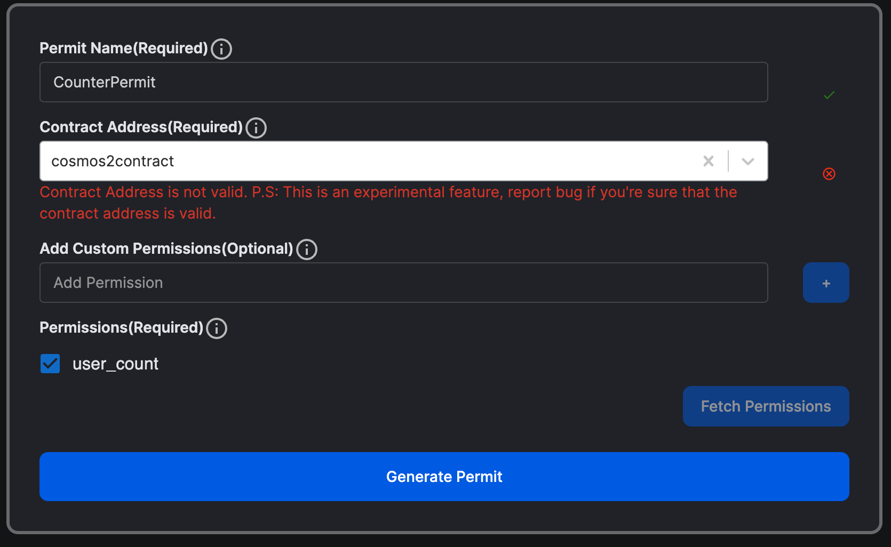

# Adding Query Permits

You can learn more about query permits over here and now it's time to implement those:

## Define the messages

First, we need to define the query messages that require permits within the QueryMsg enum. Typically, all permit queries are grouped under a single variant, while the individual permit queries are defined in a separate enum

### msg.rs

Importing Permit from secret-toolkit

```Rust
use secret_toolkit::permit::Permit;
```

Custom Permissions:

```Rust

#[cw_serde]
pub enum CounterContractPermissions {
    UserCount,
    Owner,
}
```

```Rust

#[cw_serde]
#[derive(QueryResponses)]
pub enum QueryMsg {
//..
    #[returns(QueryWithPermit)]
    WithPermit {
        permit: Permit<CounterContractPermissions>,
        query: QueryWithPermit,
    },
}

#[cw_serde]
#[derive(QueryResponses)]
pub enum QueryWithPermit {
    #[returns(GetUserCountResponse)]
    GetUserCount {},
}
```

The code defines a variant WithPermit in the QueryMsg enum to handle all permit-related queries. This variant has two fields: permit and query. The permit field represents the required permit, holding the digital signature, public address of the signer, and the plaintext message. The query field represents the specific query to be executed using the permit. These two fields allow for permit and associated query information to be passed together when making a permit-related query. This design pattern allows for flexibility and modularity, and is a common practice in SNIPs.
See that GetUserCount doesn't requires any `addr` or `key` because permit provides `addr`.

In code above we create an custom permissions enum, just for this contract. Permits allow custom Permissions other than the Permssions that Snip-20 and Snip-721 uses. Add an enum that is used by the user to give permissions to only specific queries. `Owner` permission allows to access all queries while `UserCount` permission only allows `user_count` query.

## Updating contract.rs

In the main body of the contract (typically in contract.rs), the following steps need to be taken:

1. import the permit package from Secret Toolkit

2. add message variants to the query entry point enum

3. write code to check permit validity and handle the result

4. add revoke permits execute function

### Import permit package from Secret Toolkit

```Rust

use secret_toolkit::{
    // Permit is required in any basic implementation
    permit::{ Permit },
    // requred to allow permits to be revoked
    permit::RevokedPermits,
};

```

The permit package offers Permit and RevokedPermits structures and a TokenPermissions enum for default permissions. Developers can use these defaults or create custom permissions.

### add message variants to the query entry point enum

Adding the necessary message variants to the QueryMsg enum in the query entry point of the contract.

```Rust

#[cfg_attr(not(feature = "library"), entry_point)]
pub fn query(deps: Deps, _env: Env, msg: QueryMsg) -> StdResult<Binary> {
    match msg {
        QueryMsg::GetCount {} => to_binary(&query::count(deps)?),
        QueryMsg::WithPermit { permit, query } => {
            permit_queries(
                deps, _env, // env is sometimes not needed
                permit, query,
            )
        }
        _ => query::viewing_keys_queries(deps, msg),
    }
}
```

### Write code to check permit validity and handle the result

In this step, we write code to handle permit queries within the permit_queries function.

first include this string literal as it will be prefix for revoked permits

```Rust
const PREFIX_REVOKED_PERMITS: &str = "prefix_revoked_permits";
```

Now `permit_queries`

```Rust
    pub fn permit_queries(
        deps: Deps,
        env: Env,
        permit: Permit<CounterContractPermissions>,
        query: QueryWithPermit,
    ) -> Result<Binary, StdError> {
        // Validate permit content
        let contract_address = env.contract.address;

        let account = secret_toolkit::permit::validate(
            deps,
            PREFIX_REVOKED_PERMITS,
            &permit,
            contract_address.into_string(),
            None,
        )?;

        // Permit validated! We can now execute the query.
        match query {
            QueryWithPermit::GetUserCount {} => {
                if !permit.check_permission(&CounterContractPermissions::UserCount) {
                    return Err(StdError::generic_err(format!(
                        "No permission to query balance, got permissions {:?}",
                        permit.params.permissions
                    )));
                }
                let address = Addr::unchecked(account);

                to_binary(&user_count(deps, address)?)
            }
        }
    }
```

### Adding Unit-tests

Now we're at a tricky part, to create a permit and test the permit as well. We'll be using [cryptoclerk.xyz](cryptoclerk.xyz) you can navigate to `'Permit Wizard/Permit Generator`. Here you can input your Permit Name, contract address and permission and sign it using your keplr wallet.

Here's an example for an permit generated.



Let's see unit-test

```Rust

 fn query_with_permit() {
    const USER: &str = "secret12eqwlqwcu2cundyg8ytnuhjnr29fh3zgt68602";
    const TOKEN: &str = "cosmos2contract";
    const PERMIT_NAME: &str = "CounterPermit";
    const CHAIN_ID: &str = "secret-4";

    // ... Executing counter

    // Using Permit to check the counter.

    // 1) Checking signature validity
    let permit: Permit<CounterContractPermissions> = Permit {
        params: PermitParams {
            allowed_tokens: vec![TOKEN.to_string()],
            permit_name: PERMIT_NAME.to_string(),
            chain_id: CHAIN_ID.to_string(),
            permissions: vec![CounterContractPermissions::UserCount]
        },
        signature: PermitSignature {
            pub_key: PubKey {
                r#type: "tendermint/PubKeySecp256k1".to_string(),
                value: Binary::from_base64("Ar1oSw8miosG4fJqucfb8c+HpHfr5dSvyGC5kQG9hIUy").unwrap(),
            },
            signature: Binary::from_base64("2pZXHXJZJw8s5q3ju0z9d5Njh77GtgEgLzdXcNHVg91H93MpuTHWPy99MQCUaw5O2dRE44G2GWQDqCGTwlO47w==").unwrap()
        }
    };

    let address = validate::<CounterContractPermissions>(
        deps.as_ref(),
        PREFIX_REVOKED_PERMITS,
        &permit,
        TOKEN.to_string(),
        None,
    )
    .unwrap();

    assert_eq!(
        address,
        "secret12eqwlqwcu2cundyg8ytnuhjnr29fh3zgt68602".to_string()
    );

    // Querying with correct address
    let res = query(
        deps.as_ref(),
        mock_env(),
        QueryMsg::WithPermit {
            permit: permit,
            query: crate::msg::QueryWithPermit::GetUserCount {},
        },
    )
    .unwrap();

    let value: GetUserCountResponse = from_binary(&res).unwrap();
    assert_eq!(1, value.count);
}
```

As illustrated in the code, I'm utilizing the test wallet secret12eqwlqwcu2cundyg8ytnuhjnr29fh3zgt68602 to sign the transaction. The CONTRACT_ADDRESS is predefined by the unit test developers. Each permit requires a unique identifier, hence the PERMIT_NAME was defined. Another crucial variable is the CHAIN_ID. All these constants play significant roles in the permit generation process. It's important to note that even a slight modification in any of these variables can lead change in signature which also leads to failure in the permit's validity check.

You can also see the shape of the permit ae well. And lastly, the how with permit queries are made. It is advised to used permits when querying direct to contract. inter-contracts querying should be done through viewing keys because they are easy to setup.
